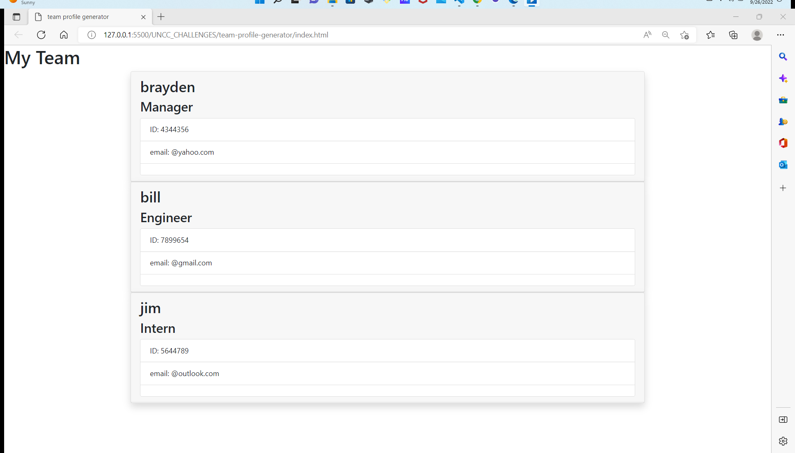

### License: , (https://opensource.org/licenses/MIT)

# Title: team-profile-generator

## Screenshot

## Description:
this is a command line app that will build a team based on user input and return an html page 
## Table of Contents:
* [title](#title)
* [Description](#description)
* [Table of Contents](#table-of-contents)
* [Installation](#installation)
* [Usage](#usage)
* [License](#license)
* [Contributing](#contributing)
* [Testing](#testing)
* [Questions](#questions)
      
## Installation: to use this app, open index.js. In the terminal type ' node index ' and then answer the questions. once you have completed all the questions a HTML file appear in the root of your folder.

## Usage: 
see installation
## Licensing: This application is covered under MIT License.

## Contributing: 
If you would like to contribute to this project feel free to reach out to me.
## Testing Instructions: 
testing was done through VS code bash terminal, if you find errors let me know!
## Questions: 
IF you have ant questions feel free to ask!
Contact Me:

Github: https://github.com/banjosquash

Email: banjosquash@gmail.com
